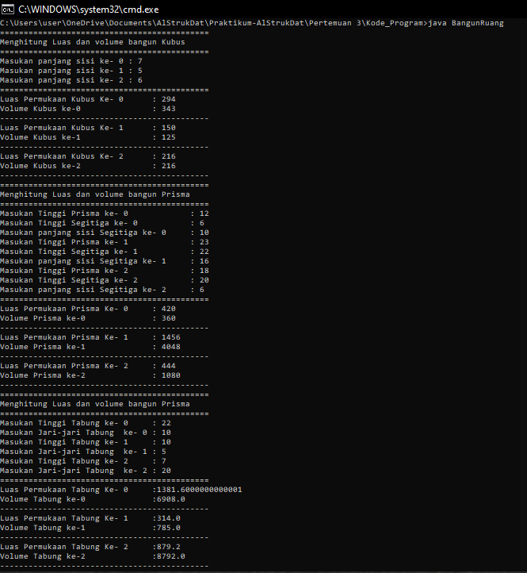
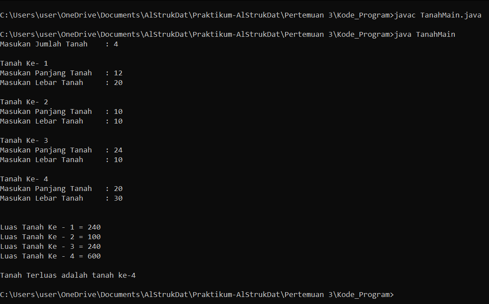
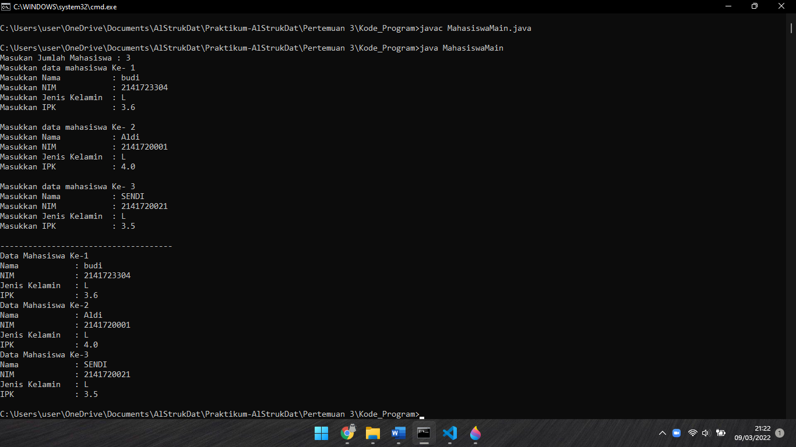

# Laporan Pertemuan 3
- Nama  : Arainal Aldiansyah
- Nim   : 2141720042
- Kelas : TI-1G

## Jawaban Pertanyaan
### 3.2.3 Pertanyaan
1. Dalam Array of object yang harus ada adalah Atribut, untuk method opsional saja sesuai kebutuhan
2. Class PersegiPanjang Tidak memiliki konstruktor, sehingga untuk pemanggilan perlu adanya pembuatan objek PersegiPanjang pada ppArray pada setiap indexnya. pada baris tersebut membuat object pada index ke 1
3. Kode tersebut berarti ppArray dapat menampung sebanyak 3 objek PersegiPanjang.
4. kode tersebut berarti bahwa untuk mengisi pada objek index ke-1 dengan mengisi atribut panjang = 80 dan lebar = 40, pada index ke-1.
5. untuk menggambarkan array of object dan menjadi lebih rapi 
### 3.3.3 Pertanyaan
1. Bisa
2. ```java
    Balok[][] b1= new Balok[1][1];
    b1[0][0]= new Manusia();
    ```
3. Karena belum ada pembuatan object baru pada index ke 5
4. ```java
    System.out.println("Masukan banyaknya objek : ");
    int length = sc.nextInt();
    PersegiPanjang[] ppArray = new PersegiPanjang[length];
    for (int i=0; i<length; i++){
        ppArray[i] = new PersegiPanjang();
        System.out.println("Persegi panjang ke- "+i);
            System.out.print("Masukan Panjang : ");
            ppArray[0].panjang =sc.nextInt();
            System.out.print("Masukan Lebar : ");
            ppArray[0].lebar = sc.nextInt();
        }
        for(int i=0; i<length; i++){
            System.out.println("Persegi Panjang ke-"+ i);
            System.out.println("Panjang "+ ppArray[i].panjang + ", lebar "+ ppArray[i].lebar);
        }
    ```
5. Jika seperti itu, akan lebih efisien jika instansiasi dilakukan 1 kali saja
### 3.4.3 Pertanyaan
1. Bisa
   ```java
   public class Buku{
       String judul;
       public Buku(){

       }
       public Buku(String j){
           judul = j;
       }
   }
   ```
2. ```java
    public class SegitigaMain{
        public static void main(String[]args){
            Segitiga[] sgArray = new Segitiga[4];

            sgArray[0]= new Segitiga(10, 4);
            sgArray[1]= new Segitiga(20, 10);
            sgArray[2]= new Segitiga(15, 6);
            sgArray[3]= new Segitiga(25, 10);

            for(int i=0; i<4; i++){
                System.out.println("Luas Segitiga ke- "+i+" : "+sgArray[i].hitungLuas());
                System.out.println("Keliling Segitiga ke- "+i+" : "+sgArray[i].hitungKeliling());
                System.out.println("===================================");
            }
        }
    }
    class Segitiga{
        public int alas;
        public int tinggi;

        public Segitiga(int a, int t){
            alas = a;
            tinggi = t;
        }
        public int hitungLuas(){
            return (alas * tinggi)/2;
        }
        public int hitungKeliling(){
            return alas+alas+alas;
        }
    
    }
### Latihan dan Praktikum
1. ```java 
    import java.util.Scanner;
    public class BangunRuang{
    public static void main(String[]args){
        Scanner sc = new Scanner(System.in);
        
        //KUBUS
        System.out.println("============================================");
        System.out.println("Menghitung Luas dan volume bangun Kubus");
        System.out.println("============================================");
        Kubus[] kArray = new Kubus[3];
        for(int i=0; i<3; i++){
            kArray[i] = new Kubus();
            System.out.print("Masukan panjang sisi ke- "+i+" : ");
            kArray[i].sisi = sc.nextInt();
        }
        System.out.println("============================================");
        for(int i=0; i<3; i++){
            System.out.println("Luas Permukaan Kubus Ke- "+i+" : " + kArray[i].luasPermukaan());
            System.out.println("Volume Kubus ke-"+i+" : "+kArray[i].volume());
        }

        //PRISMA
        System.out.println("============================================");
        System.out.println("Menghitung Luas dan volume bangun Prisma");
        System.out.println("============================================");
        Prisma[] pArray = new Prisma[3];

        for(int i=0; i<3; i++){
            pArray[i] = new Prisma();
            System.out.print("Masukan Tinggi Prisma ke- "+i+" : ");
            pArray[i].tinggiPrisma = sc.nextInt();
            System.out.print("Masukan Tinggi Segitiga ke- "+i+" : ");
            pArray[i].tinggiSegitiga = sc.nextInt();
            System.out.print("Masukan panjang sisi Segitiga ke- "+i+" : ");
            pArray[i].sisiSegitiga = sc.nextInt();
        }
        System.out.println("============================================");
        for(int i=0; i<3; i++){
            System.out.println("Luas Permukaan Prisma Ke- "+i+" : " + pArray[i].luasPermukaan());
            System.out.println("Volume Prisma ke-"+i+" : "+pArray[i].volume());
        }

        //TABUNG
        System.out.println("============================================");
        System.out.println("Menghitung Luas dan volume bangun Prisma");
        System.out.println("============================================");
        Tabung[] tArray = new Tabung[3];

        for(int i=0; i<3; i++){
            tArray[i] = new Tabung();
            System.out.print("Masukan Tinggi Tabung ke- "+i+" : ");
            tArray[i].tinggi = sc.nextInt();
            System.out.print("Masukan Jari-jari Tabung  ke- "+i+" : ");
            tArray[i].jariJari = sc.nextInt();
        }
        System.out.println("============================================");
        for(int i=0; i<3; i++){
            System.out.println("Luas Permukaan Tabung Ke- "+i+" : " + tArray[i].luasPermukaan());
            System.out.println("Volume Tabung ke-"+i+" : "+tArray[i].volume());
        }
        System.out.println("============================================");

    }
    }
    class Kubus{
        public int sisi;

        public int luasPermukaan(){
            return (sisi*sisi)*6;
        }
        public int volume(){
            return sisi*sisi*sisi;
        }
    }

    class Prisma{
        public int sisiSegitiga, tinggiPrisma, tinggiSegitiga;
    
        public int luasPermukaan(){
            return (2*((tinggiSegitiga*sisiSegitiga)/2))+(3*(sisiSegitiga*tinggiPrisma));
        }
        public int volume(){
            return ((sisiSegitiga*tinggiSegitiga)/2)*tinggiPrisma;
        }
    }

    class Tabung{
        public double phi=3.14;
        public int jariJari, tinggi;
    
        public double luasPermukaan(){
            return 2*phi*(jariJari*tinggi);
        }
        public double volume(){
            return phi*jariJari*jariJari*tinggi;
        }
    }
output = 



2.  ```java 
    import java.util.Scanner;
    public class TanahMain{
    public static void main(String[]args){
        Scanner sc = new Scanner(System.in);

        //Input Jumlah Tanah
        System.out.print("Masukan Jumlah Tanah\t: ");
        int jmlh = sc.nextInt();

        Tanah [] tArray = new Tanah[jmlh];

        System.out.println("");
        //Input Panjang dan lebar
        for(int i=0; i<jmlh; i++){
            tArray[i]= new Tanah();
            System.out.println("Tanah Ke- "+(i+1));
            System.out.print("Masukan Panjang Tanah\t: ");
            tArray[i].panjang = sc.nextInt();
            System.out.print("Masukan Lebar Tanah\t: ");
            tArray[i].lebar = sc.nextInt();
            System.out.println("");
        }
        System.out.println("");

        //Tampil Luas Tanah
        for(int i=0; i<jmlh; i++){
            System.out.println("Luas Tanah Ke - "+(i+1)+" = "+ tArray[i].luas());
        }
        //Mencari tanah terluas
        int max=0, n=0;
        for (int i=0; i<jmlh; i++){
            if(tArray[i].luas() > max){
                max = tArray[i].luas();
                n=i+1;
            }     
        }
        System.out.println("");
        System.out.println("Tanah Terluas adalah tanah ke-"+n);

    }
    }

```java
    public class Tanah{
        public int panjang, lebar;

        public int luas(){
            return panjang*lebar;
        }
    }
```
OUTPUT =  

3. ```java 
   import java.util.Scanner;
    public class MahasiswaMain{
    public static void main(String[]args){
        Scanner sc = new Scanner (System.in);

        System.out.print("Masukan Jumlah Mahasiswa : ");
        int jmlh = sc.nextInt();
        Mahasiswa[] mArray = new Mahasiswa[jmlh];

        for(int i=0; i<jmlh; i++){
            mArray[i] = new Mahasiswa();
            System.out.println("Masukkan data mahasiswa Ke- "+(i+1));
            System.out.print("Masukkan Nama\t\t: ");
            mArray[i].nama=sc.next();
            System.out.print("Masukkan NIM\t\t: ");
            mArray[i].nim=sc.next();
            System.out.print("Masukkan Jenis Kelamin\t: ");
            mArray[i].j_kelamin=sc.next();
            System.out.print("Masukkan IPK\t\t: ");
            mArray[i].ipk=sc.next();
            System.out.println();
        }
        System.out.println("-------------------------------------");
        for(int i=0; i<jmlh; i++){
            System.out.println("Data Mahasiswa Ke-"+(i+1));
            System.out.println("Nama\t\t: "+mArray[i].nama);
            System.out.println("NIM\t\t: "+mArray[i].nim);
            System.out.println("Jenis Kelamin\t: "+mArray[i].j_kelamin);
            System.out.println("IPK\t\t: "+mArray[i].ipk);
        }
    }
    }


```java
    public class Mahasiswa{
        public String nama, nim, j_kelamin, ipk;

    }
```
OUTPUT =  