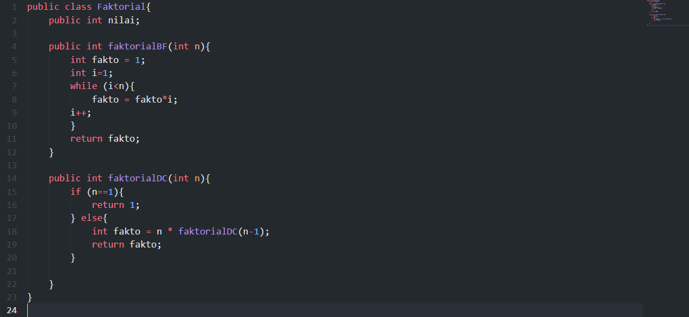
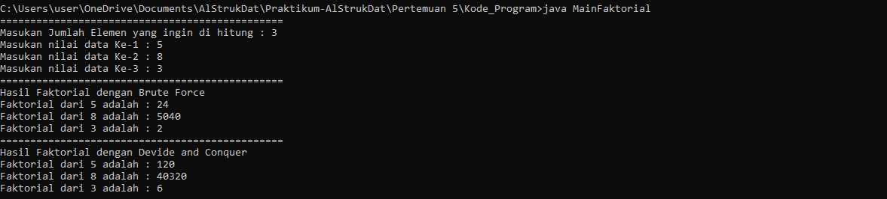
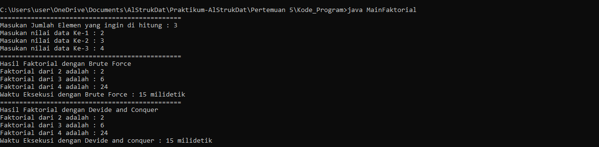
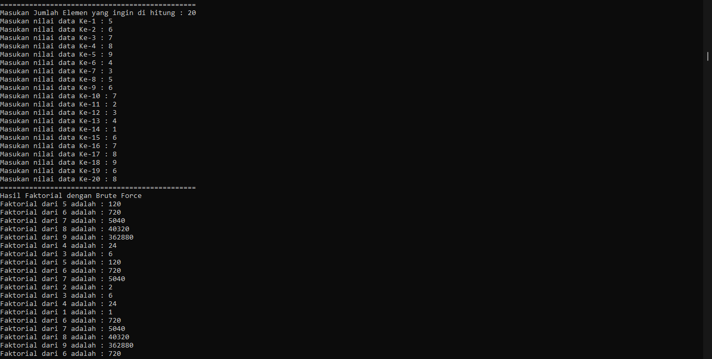
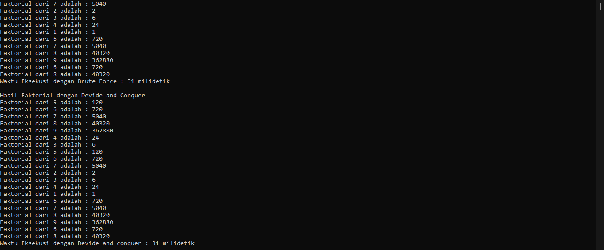
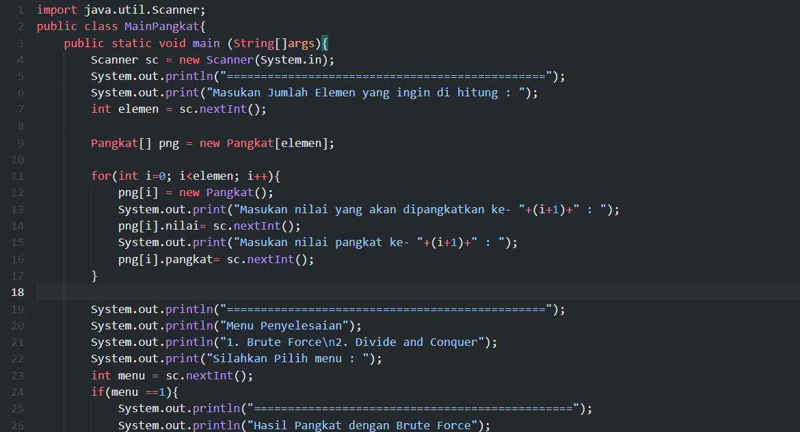
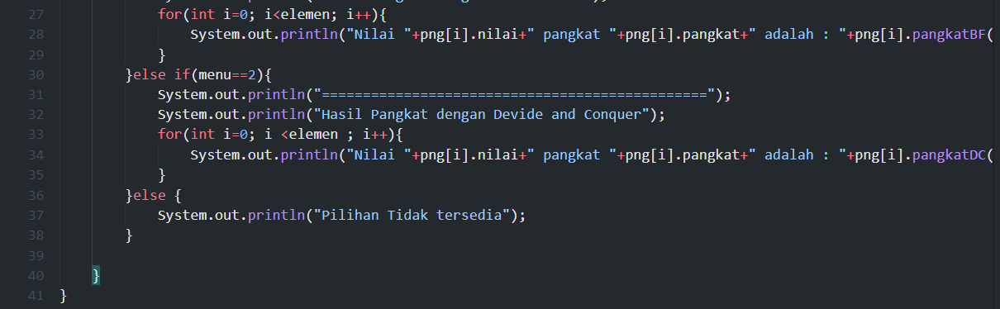
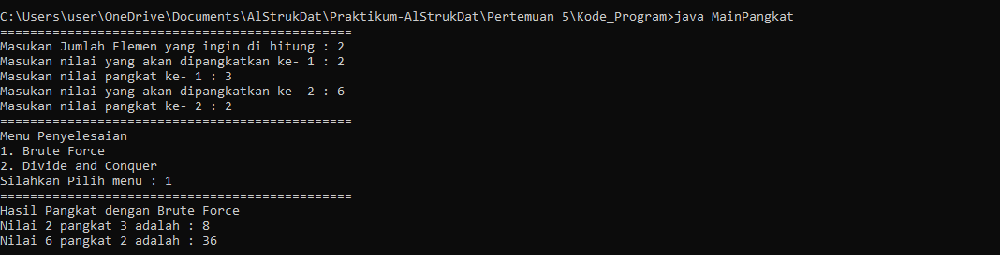

# Laporan Pertemuan 5

- Nama  : Arainal Aldiansyah
- Nim   : 2141720042
- Kelas : TI-1G

## Jawaban Pertanyaan
### 4.2.3 Pertanyaan
1. **Jelaskan mengenai base line Algoritma Divide Conquer untuk melakukan pencarian nilai faktorial!**
    - Pertama adalah Method faktorialDC akan berjalan dengan parameter n yang merupakan nilai yang akan difaktorkan. kemudian akan di cek, jika n sama dengan 1 maka return akan 1, jika n tidak sama 1 maka akan dikurangi 1. dimana setiap perulangannya dilakukan oleh pemanggilan method itu sendiri yang akan berkurang 1 sampai nilai n ==1. dan menjadi perkalian terakhir 1 dan akan mereturn nilai fakto
  
2. **Pada implementasi Algoritma Divide and Conquer Faktorial apakah lengkap terdiri dari 3 tahapan divide conquer, combine? Jelaskan masing-masing bagiannya pada kode program!**
    - Divide = faktorialDC(n-1)
    - Conquer = n*faktorialDC(n-1)
    - Combine = fakto = n * faktorialDC(n-1);
3. **Apakah memungkinkan perulangan pada method faktorialBF() dirubah selain menggunakan for? Buktikan!**
    - Bisa, dengan menggunakan perulangan while atau pun do while
    ```java
        int i=1;
        while (i<n){
            fakto = fakto*i;
        i++;
        }
    ```
    
    Output
    
4. **Tambahkan pegecekan waktu eksekusi kedua jenis method tersebut!**
    - Dengan menambahkan code 
    ```java
        long startTime= System.currentTimeMillis();
        //Kode Program atau method yang dieksekusi
        long endTime=System.currentTimeMillis(); // mengambil waktu akhir eksekusi
        long elapsedTime= endTime – startTime; // menghitung waktu eksekusi
        System.out.println("Waktu Eksekusi: "+ String.valueOf(elapsedtime)+" milidetik");
    output
    
5. **Buktikan dengan inputan elemen yang di atas 20 angka, apakah ada perbedaan waktu eksekusi?**
   - ada Perbedaan karena melalukan eksekusi lebih banyak sehingga waktu juga menjadi bertambah
    Output
    
    

### 4.3.3 Pertanyaan
1. **Jelaskan mengenai perbedaan 2 method yang dibuat yaitu PangkatBF() dan PangkatDC()!**
    - PangkatBF() : dalam perulangannya fungsi ini menggunakan intruksi tersendiri dengan syarat dan batasan sendiri sampai tidak memenuhi
    - PangkatDC() : perulangan dengan fungsi rekursif dimana setiap perulangannya dengan memanggil fungsi itu sendiri.
2. **Pada method PangkatDC() terdapat potongan program, Jelaskan arti potongan kode tersebut**
    - pada potongan tersebut berarti bahwa jika bilangan tersebut ganjil maka perlu ditambah untuk di kali variabel 1, dan jika nilainya genap tidak perlu untuk dikali dengan a
3. **Apakah tahap combine sudah termasuk dalam kode tersebut?Tunjukkan!**
    - Tahap combine sudah terdapat dalam program : 
    ```java
         return(pangkatDC(a, n/2)*pangkatDC(a,n/2));
    ```
4. **Modifikasi kode program tersebut, anggap proses pengisian atribut dilakukan dengan konstruktor.**
```java
        //Class Main
        for(int i=0; i<elemen; i++){
            System.out.print("Masukan nilai yang akan dipangkatkan ke- "+(i+1)+" : ");
            int a = sc.nextInt();
            System.out.print("Masukan nilai pangkat ke- "+(i+1)+" : ");
            int n = sc.nextInt();
            png[i] = new Pangkat(a, n);
        }
    //Konstruktor class pangkat
        Pangkat(int bil, int pang){
        nilai = bil;
        pangkat = pang;
    }
```
5. **Tambahkan menu agar salah satu method yang terpilih saja yang akan dijalankan!**
   
   
   output
   

### 4.4.3 Pertanyaan
1. **Berikan ilustrasi perbedaan perhitungan keuntungan dengan method TotalBF() ataupun TotalDC()**
    - TotalBF() : melakukan perhitungan dengan melakukan perulangan dengan total ditambah dengan nilai array dari inputan keuntungan kemudian return total.
    - TotalDC() : melakukan perhitungan dengan melakukan perulangan secara rekursif

2. **Perhatikan output dari kedua jenis algoritma tersebut bisa jadi memiliki hasil berbeda di belakang koma. Bagaimana membatasi output di belakang koma agar menjadi standar untuk kedua jenis algoritma tersebut.**
    - dengan memberikan pembatasan karakter : String.format("%.2f", sm.totalBF(sm.keuntungan))
  
3. **Mengapa terdapat formulasi return value berikut?Jelaskan!**
    - Return tersebut berguna untuk mengembalikan hasil penjumlahan lsum+rsum+arr[mid] 
4. **Kenapa dibutuhkan variable mid pada method TotalDC()?**
    - untuk menampung nilai sebagai hasil untuk membagi upa masalah yang dijadikan parameter tahap rekursif
5. **Program perhitungan keuntungan suatu perusahaan ini hanya untuk satu perusahaan saja. Bagaimana cara menghitung sekaligus keuntungan beberapa bulan untuk beberapa perusahaan.(Setiap perusahaan bisa saja memiliki jumlah bulan berbeda-beda)? Buktikan dengan program!**
```java
    import java.util.Scanner;
    public class MainSum{
    public static void main(String[]args){
        Scanner sc =new Scanner(System.in);
        System.out.println("============================================================");
        System.out.println("Program Menghitung Keuntungan total (Satuan juta, misal 5.9)");
        System.out.print("Masukkan jumlah perusahaan : ");
        int prsh = sc.nextInt();
        int jml = 0;
        for(int i=0; i<prsh; i++){
            System.out.print("Masukkan jumlah bulan Perusahaan ke-"+(i+1)+" : ");
            int elm =sc.nextInt();
            jml = elm;
        }
        Sum sm = new Sum(jml, prsh);
        System.out.println("============================================================");
        for(int i=0; i<prsh; i++){
            System.out.println("Masukkan untung Perusahaan ke-"+(i+1));
            for(int j=0; j<jml; j++){
                System.out.print("Masukkan untung bulan ke-"+(j+1)+" = ");
                sm.keuntungan[j] = sc.nextDouble();
            }
        }
        for(int i=0; i<prsh; i++){
            System.out.println("Untung Perusahaan ke-"+(i+1));
            System.out.println("=============================================================");
            System.out.println("Algoritma Bruce Force");
            System.out.println("Total Keuntungan Perusahaan Selama "+sm.elemen[i]+" bulan adalah "+sm.totalBF(sm.keuntungan));
            System.out.println("=============================================================");
            System.out.println("Algoritma Divide and Conquer");
            System.out.println("Total Keuntungan Perusahaan Selama "+sm.elemen[i]+" bulan adalah "+sm.totalDC(sm.keuntungan, 0, sm.elemen[i]-1));
        }
        }
    }
```

