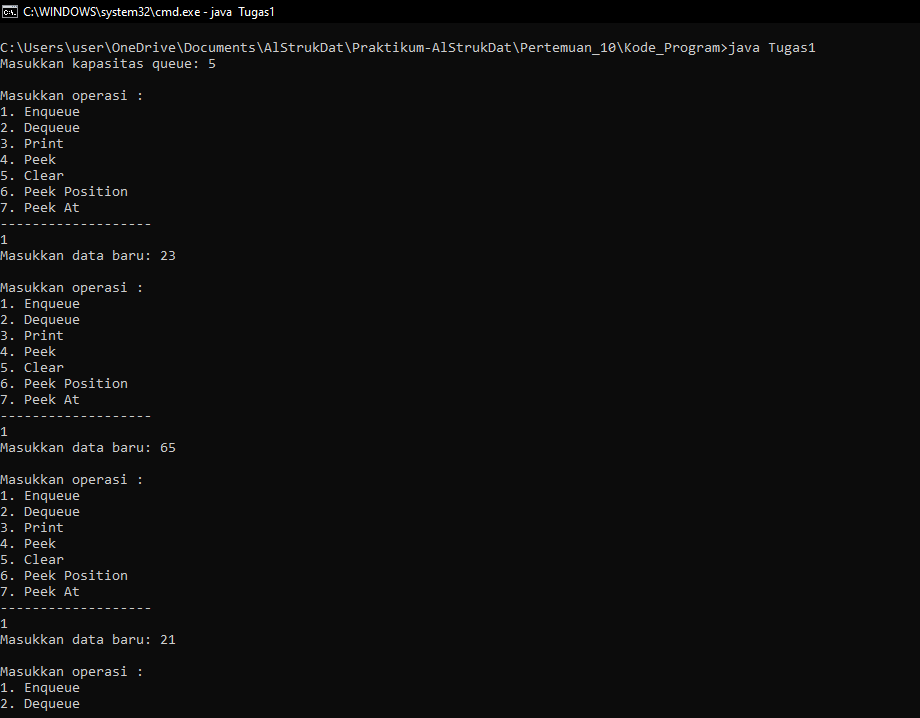
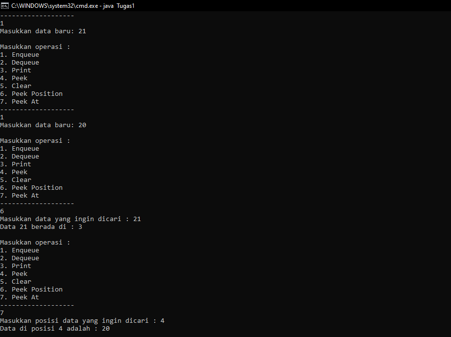
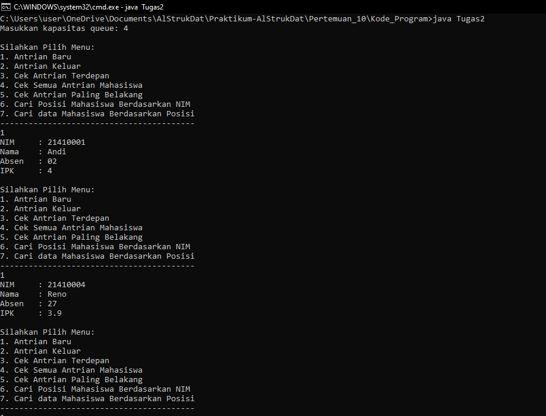

# Laporan Pertemuan 10 - QUEUE

- Nama  : Arainal Aldiansyah
- Nim   : 2141720042
- Kelas : TI-1G

## Jawaban Pertanyaan
### 8.2.3 Pertanyaan
1. Pada konstruktor, mengapa nilai awal atribut front dan rear bernilai -1, sementara atribut size 
bernilai 0?
- Karena sebagai asumsi bahwa queue masih kosong dan tidak berapa di index, sehingga size mnegikuti bahwa ukuran masih 0
2. Pada method Enqueue, jelaskan maksud dan kegunaan dari potongan kode berikut!
- jika nilai rear sama dengan max-1 maka nilai rear di pindah ke depan
3. Pada method Dequeue, jelaskan maksud dan kegunaan dari potongan kode berikut!
- jika nilai front sama dengan max-1 maka nilai front di pindah ke depan
4. Pada method print, mengapa pada proses perulangan variabel i tidak dimulai dari 0 (int i=0), melainkan int i=front?
- Karena posisi nilai awal tidak selalu dimaulai dari index ke 0
5. Perhatikan kembali method print, jelaskan maksud dari potongan kode berikut!
- Kode tersebut bermaksud agar nilai i tidak melebihi nilai max
6. Tunjukkan potongan kode program yang merupakan queue overflow!
``` java
    System.out.println("Masukan data baru : ");
    int dataMasuk= sc.nextInt();
    Q.Enqueue(dataMasuk);
    break;
    -----
    if(isFull()){
        System.out.println("Queue Sudah Penuh");
    }
```
7. Pada saat terjadi queue overflow dan queue underflow, program tersebut tetap dapat berjalan dan hanya menampilkan teks informasi. Lakukan modifikasi program sehingga pada saat terjadi queue overflow dan queue underflow, program dihentikan!
```java
    public int Enqueue(int dt) { 
        if (IsFull()) { System.out.println("Queue sudah penuh");
            return 0; 
        } else { 
            if (IsEmpty()){ front = rear = 0; 
            } else { 
                if (rear == max - 1) { rear = 0; 
                } else { 
                    rear++;
                } 
            }
            data[rear] = dt;
            size++; 
            return 1; 
        } 
    }
```
```java
//Main
case 1:
    System.out.print("Masukkan data baru: ");
    int dataMasuk = sc.nextInt();
    pilih = Q.Enqueue(dataMasuk);
    break;
case 2:
    int dataKeluar = Q.Dequeue();
    if (dataKeluar != 0) {
        System.out.println("Data yang dikeluarkan: " + dataKeluar);
        break;
    } else {
        pilih = dataKeluar;
        break;
    }
```

### 8.3.3 Pertanyaan
1. Pada class QueueMain, jelaskan fungsi IF pada potongan kode program berikut!
- jika data norek, nama, alamat, umur dan saldo tidak sama dengan 0 maka akan di print datanya
2. Lakukan modifikasi program dengan menambahkan method baru bernama peekRear pada class Queue yang digunakan untuk mengecek antrian yang berada di posisi belakang! Tambahkan pula daftar menu 5. Cek Antrian paling belakang pada class QueueMain sehingga method peekRear dapat dipanggil!
```java
    //class queue
    public void peekRear() {
        if (!IsEmpty()) {
            System.out.println("Elemen terbelakang: " + data[rear].norek + " " + data[rear].nama + " "
                + data[rear].alamat + " " + data[rear].umur + " " + data[rear].saldo);
        } else {
            System.out.println("Queue masih kosong");
        }
    }
```
```java
    // Main
    case 5:
        antri.peekRear();
        break;
    }

    } while (pilih == 1 || pilih == 2 || pilih == 3 || pilih == 4 || pilih == 5);
```
### Tugas
1. output Tugas 1


2. output Tugas 2

