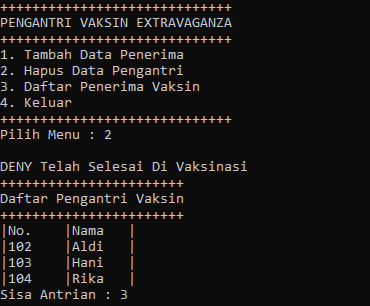

# Laporan Pertemuan 12 Double Linked List

- Nama  : Arainal Aldiansyah
- Nim   : 2141720042
- Kelas : TI-1G

## Jawaban Pertanyaan
### 12.2.3 Pertanyaan Percobaan
1. Jelaskan perbedaan antara single linked list dengan double linked lists!
   - Link list hanya memiliki satu pointer saja(next) sedangkan Double Linkedlist memiliki 2 pointer (prev dan next)
2. Perhatikan class Node, didalamnya terdapat atribut next dan prev. Untuk apakah atribut tersebut?
   - Next Digunakan untuk menunjuk node setelahnya
   - Prev digunakan untuk menunjuk node sebelumnya
3. Perhatikan konstruktor pada class DoubleLinkedLists. Apa kegunaan inisialisasi atribut head dan size seperti pada gambar berikut ini?
   - Head = null --> dimaksudkan bahwa belum terdapat nilai sama sekali/ masih kosong
   - Size = 0 --> dimaksudkan karena belum ada nilai dari head maka ukurannya masih 0 
4. Pada method addFirst(), kenapa dalam pembuatan object dari konstruktor class Node prev dianggap sama dengan null? Node newNode = new Node(null, item, head);
   - karena nilai sebelum node paling depan harus null karena berada diposisi terdepan sehingga sebelumnya/prevnya tidak ada nilainya
5. Perhatikan pada method addFirst(). Apakah arti statement head.prev = newNode ?
   - Digunakan untuk menginisialisasi nilai yang sebelumnya null menjadi node tambahan yang baru dan menggeser node sebelumnya
6. Perhatikan isi method addLast(), apa arti dari pembuatan object Node dengan mengisikan parameter prev dengan current, dan next dengan null? Node newNode = new Node(current, item, null);
   - Dimaksudkan current yang merupakan node terakhir di sebelmnya diganti ke sebelumnya dan di isi lagi dengan item tambahan dan karena node terakhir maka nextnya menjadi null/kosong
   
### 12.3.3 Pertanyaan Percobaan
1. Apakah maksud statement berikut pada method removeFirst()?
    head = head.next;
    head.prev = null;
    - dimaksudkan bahwa node yang sebelumnya menjadi head diganti headnya ke setelahnya, setelah node setelahnya menjadi head, maka nilai prevnya/sebelumnya yang tadinya head diganti menjadi null
2. Bagaimana cara mendeteksi posisi data ada pada bagian akhir pada method removeLast()?
   - Dengan membuat inisialisasi current kemudian akan di cek dengan perulangan while dan current terus digeser keselanjutnya/next sampai 2 kali setelahnya bernilai null maka current next terakhir akan diganti menjadi null dan size berkurang 1
3. Jelaskan alasan potongan kode program di bawah ini tidak cocok untuk perintah remove!
   - Karena inisialisasi pertama sudah dinext, sehingga tidak mengecek head 
4. Jelaskan fungsi kode program berikut ini pada fungsi remove!
   - current sebelumnya akan menunjuk ke current selanjutnya dan bernilai current selanjutnya yang baru
   - curent setelahnya akan menunjuk current sebelumnya dan akan bernilai current sebelmunya yang baru

### 12.4.3 Pertanyaan Percobaan
1. Jelaskan method size() pada class DoubleLinkedLists!
   - method size dimaksudkan untuk mengetahui banyak node pada double link list
2. Jelaskan cara mengatur indeks pada double linked lists supaya dapat dimulai dari indeks ke-1!
3. Jelaskan perbedaan karakteristik fungsi Add pada Double Linked Lists dan Single Linked Lists!
   - Add pada Double linked list harus merubah posisi sebelum dan sesudahnya
   - sedangkan pada list List merubah nilai lama menjadi setelahnya
4. Jelaskan perbedaan logika dari kedua kode program di bawah ini!
    (a) jika size == 0 maka isEmpty bernilai true dan jika tidak maka isEmpty false
    (b) isEmpty akan mendapat return bernilai True jika head == null. jika tidak sama Maka isempty False

### 12.5 Tugas Praktikum
1.  Buat program antrian vaksinasi menggunakan queue berbasis double linked list sesuai ilustrasi dan menu di bawah ini! (counter jumlah antrian tersisa di menu cetak(3) dan data orang yang telah divaksinasi di menu Hapus Data(2) harus ada)
```java
import java.util.Scanner;
public class Tugas1{
    public static void main(String[]args){
        Scanner sc = new Scanner(System.in);
        DoubleLinkedList dll = new DoubleLinkedList();
        int pilihan;
        do {

            System.out.println("+++++++++++++++++++++++++++++");
            System.out.println("PENGANTRI VAKSIN EXTRAVAGANZA");
            System.out.println("+++++++++++++++++++++++++++++");
            System.out.println("1. Tambah Data Penerima");
            System.out.println("2. Hapus Data Pengantri");
            System.out.println("3. Daftar Penerima Vaksin");
            System.out.println("4. Keluar");
            System.out.println("+++++++++++++++++++++++++++++");
            System.out.print("Pilih Menu : ");
            pilihan = sc.nextInt();
            System.out.println("");
            if (pilihan == 1){
                sc.nextLine();
                System.out.println("-----------------------------");
                System.out.println("Masukkan Data Penerima Vaksin");
                System.out.println("-----------------------------");
                System.out.print("Nomor Antrian : ");
                String nomor = sc.nextLine();
                System.out.print("Nama Penerima : ");
                String nama = sc.nextLine();
                System.out.println("");
                dll.Enqueue(nomor, nama);
            }
            if (pilihan == 2){
                dll.Dequeue();
            }
            if (pilihan == 3){
                dll.Print();
            }
            if (pilihan == 4){
                pilihan = 4;
            }
        } while (pilihan != 4);
    }
}

class Node{
    String nama, no;
    Node prev, next;

    Node (Node prev, String no, String nama,  Node next){
        this.prev =prev;
        this.no=no;
        this.nama = nama;
        this.next = next;
    }
}

class DoubleLinkedList{
    Node head;
    int size;

    DoubleLinkedList(){
        head = null;
        size = 0;
    }
    public boolean isEmpty() {
        return head == null;
    }

    public void Print() {
        if (!isEmpty()) {
            Node tmp = head;
            System.out.println("+++++++++++++++++++++++");
            System.out.println("Daftar Pengantri Vaksin");
            System.out.println("+++++++++++++++++++++++");
            System.out.println("|No.\t|Nama\t|");
            while (tmp != null) {
                System.out.println("|" + tmp.no + "\t|" + tmp.nama+"\t|");
                tmp = tmp.next;
        }
        
        System.out.println("Sisa Antrian : " + size);
        } else {
            System.out.println("Linked List Queue Masih Kosong");
        }
    }

    public void Enqueue(String no, String nama) {
        Node newNode = new Node(null, no, nama, null);
        if (isEmpty()) {
            head = newNode;
        } else {
            Node current = head;
            while (current.next != null){
                current = current.next;
            }
            current.next = newNode;
        }
        size++;
    }
    public void removeLast(){
        if(isEmpty()){
            System.out.println("Linked List Queue Masih Kosong");
        }else if (head.next == null){
            head=null;
            size--;
            return;
        }
        Node current = head;
        while(current.next.next != null){
            current = current.next;
        }
        current.next = null;
        size--;
    }
    public void Dequeue() {
        if (isEmpty()) {
            System.out.println("Linked List Masih Kosong, tidak dapat di hapus");
        } else if (size == 1) {
           System.out.println(head.nama + " Telah Selesai Di Vaksinasi");
           removeLast();
        } else {
            System.out.println(head.nama + " Telah Selesai Di Vaksinasi");
            head = head.next;
            head.prev = null;
            size--;
        }
    }

}
```




2. Buatlah program daftar film yang terdiri dari id, judul dan rating menggunakan double linked lists, bentuk program memiliki fitur pencarian melalui ID Film dan pengurutan Rating secara descending. Class Film wajib diimplementasikan dalam soal ini.