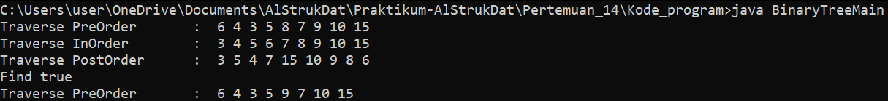
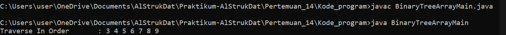
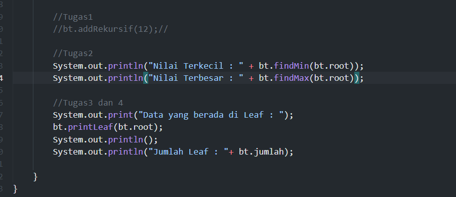
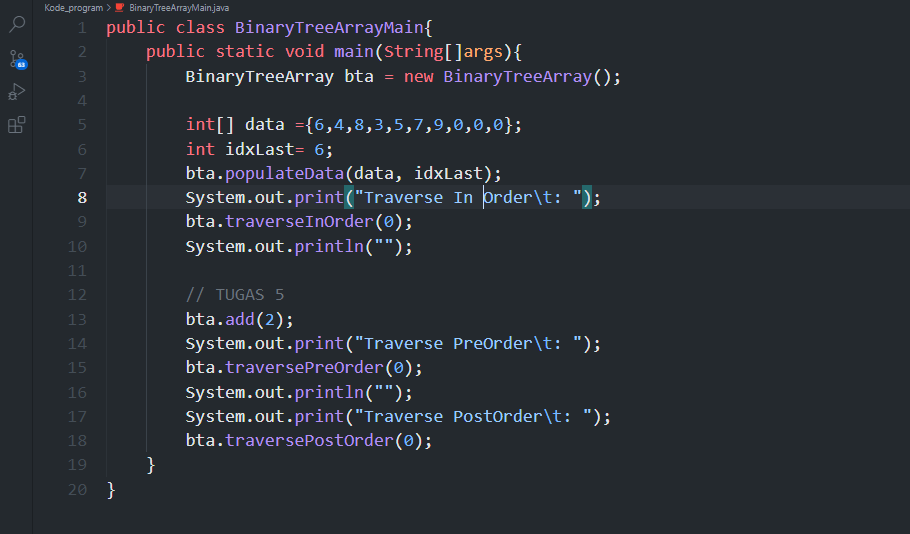
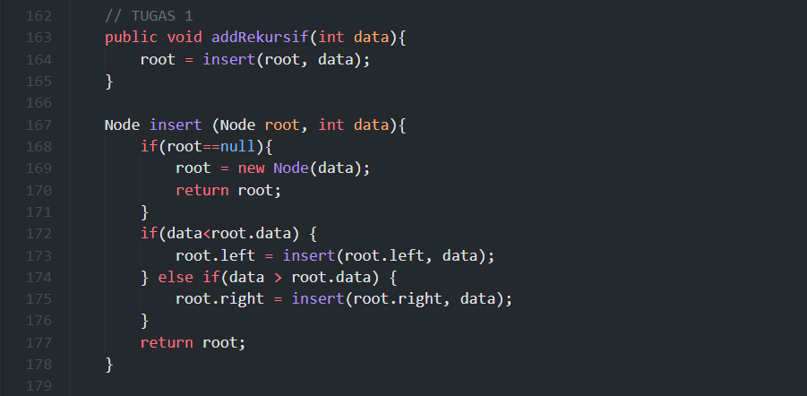
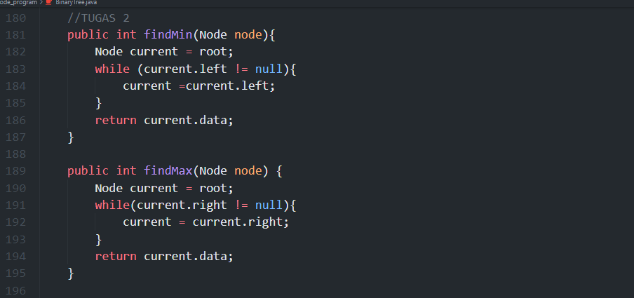
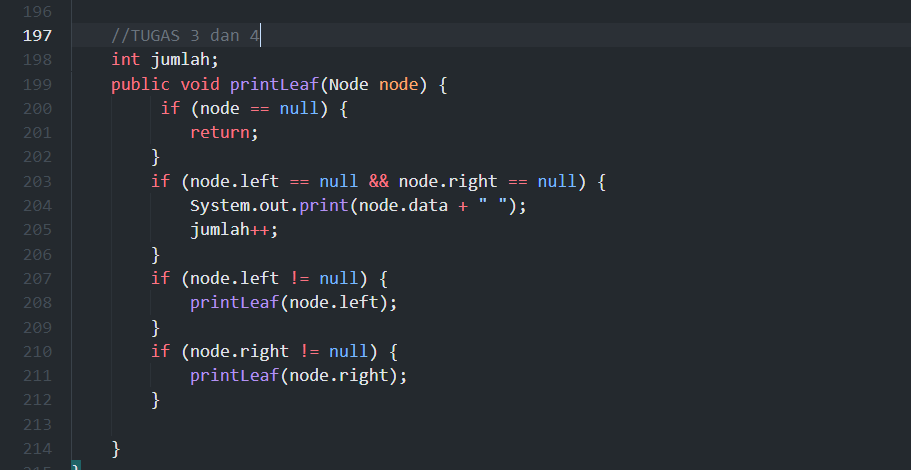
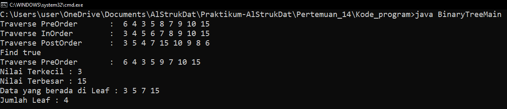
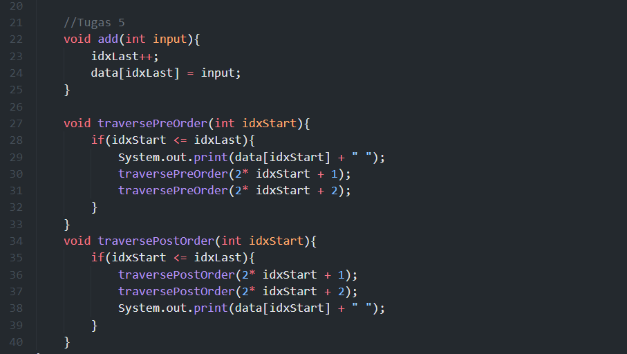
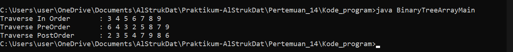

# Laporan Pertemuan 14 Tree

- Nama  : Arainal Aldiansyah
- Nim   : 2141720042
- Kelas : TI-1G

## Jawaban Pertanyaan
### 2.1.2 Pertanyaan Percobaan
1. Mengapa dalam binary search tree proses pencarian data bisa lebih efektif dilakukan dibanding binary tree biasa?
   - Karena Pada binary Search Tree dibagi menjadi dua bagian kiri untuk nilai terkecil dan semakin ke kanan semakin besar dengan nilai root sebagai penengah sehingga menjadi lebih teliti dan efektif.
2. Untuk apakah di class Node, kegunaan dari atribut left dan right?
   - digunakan untuk membagi 2 kubu kiri untuk bilangan kecil dan kanan untuk besar
3.  a. Untuk apakah kegunaan dari atribut root di dalam class BinaryTree?
   - digunakan untuk menandakan bahwa node adalah node teratas
    b. Ketika objek tree pertama kali dibuat, apakah nilai dari root?
    - root bernilai 0

4. Ketika tree masih kosong, dan akan ditambahkan sebuah node baru, proses apa yang akan terjadi?
   - node akan dibuat dengan left dan rightnya bernilai null
5. Perhatikan method add(), di dalamnya terdapat baris program seperti di bawah ini. Jelaskan secara detil untuk apa baris program tersebut?
```java
    if(data<current.data){
        if(current.left!=null){
            current = current.left;
        }else{
            current.left = new Node(data);
        break;
    }
```
   - jika nilai yang ditambahkan lebih kecil dari nilai di node current maka di cek kembali apakah nilai kiri null atau tidak jika ya maka akan digeser lagi ke kiri dan kembali lagi, jika null maka nilai kiri yang bernilai null itu di buatkan node baru dengan inputan.
Hasil Percobaan :


### 13.2.1 Pertanyaan Percobaan
1. Apakah kegunaan dari atribut data dan idxLast yang ada di class BinaryTreeArray?
   - data digunakan sebagai tempat penyimpanan arrray dan idxLast untuk inisialisasi alamat indeks dari array
2. Apakah kegunaan dari method populateData()?
   - Digunakan untuk menyimpan data dari array data dan indxLast sebagai alamat indeks
3. Apakah kegunaan dari method traverseInOrder()?
   - untuk menampilkan dari dari bagian kiri dari bagian anak paling kiri root  kemudian dilanjutkan bagian kanan dari anak paling kiri
4. Jika suatu node binary tree disimpan dalam array indeks 2, maka di indeks berapakah posisi left child dan rigth child masing-masing?
   - left child = 1 dan right child = 3
5. Apa kegunaan statement int idxLast = 6 pada praktikum 2 percobaan nomor 4?
   - untuk menunjukan alamat index yang dibatasi di indeks ke 6

Hasil Percobaan : 


### Tugas
Tugas Main



- Tugas Nomor 1 


- Tugas Nomor 2


- Tugas Nomor 3 & 4

Hasil :


- Tugas Nomor 5



Hasil : 
   
