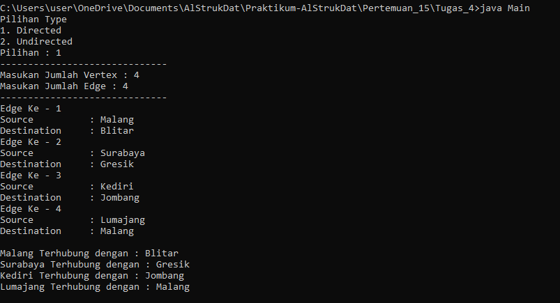

# Laporan Pertemuan 15 - GRAPH
- Nama  : Arainal Aldiansyah
- Nim   : 2141720042
- Kelas : TI-1G

## Jawaban Pertanyaan
### Hasil Output Praktikum 1


### 2.1.3 Pertanyaan Percobaan
1. Sebutkan beberapa jenis (minimal 3) algoritma yang menggunakan dasar Graph, dan apakah kegunaan algoritma-algoritma tersebut?
   - Algoritma Brent untuk menentukan adanya daur ulang didalam sebuah Graph
   - Algoritma Hungaria untuk penjodohan sempurna
   - Algoritma Hopcroft-Karp untuk menentukan pehubungan maksimum

2. Pada class Graph terdapat array bertipe LinkedList, yaitu LinkedList list[]. Apakah tujuan pembuatan variabel tersebut ?
   - Digunakan untuk memanggil objek linkedList dan ditujukan untuk mengsisi vertex
3. Apakah alasan pemanggilan method addFirst() untuk menambahkan data, bukan method add jenis lain pada linked list ketika digunakan pada method addEdge pada class Graph?
   - Digunakan untuk menambahkan data di posisi awal untuk dihubungkan dengan hubungannya
4. Bagaimana cara mendeteksi prev pointer pada saat akan melakukan penghapusan suatu edge pada graph ?
   - Dapat dilihat saat looping edge saat i == destination maka edge akan dihapus
5. Kenapa pada praktikum 2.1.1 langkah ke-12 untuk menghapus path yang bukan merupakan lintasan pertama kali menghasilkan output yang salah ? Bagaimana solusinya ?
   - Data vertex yang dilewati mengalami perubahan lintasan

### Praktikum 2
Output :

###  2.2.3 Pertanyaan Percobaan
1. Apakah perbedaan degree/derajat pada directed dan undirected graph?
   - Nilai Degree pada directed akan berbeda dan tidak selalu berhubungan kembali, sedangkan
   - pada Undirected nilai akan sama dan akan berhubungan
2. Pada implementasi graph menggunakan adjacency matriks. Kenapa jumlah vertices harus ditambahkan dengan 1 pada indeks array berikut?
   - Karena sebuah array di mulai dari 0, dan agar output yang dikeluarkan sesuai vertex maka harus di tambah 1
3. Apakah kegunaan method getEdge() ?
   - Digunakan untuk mencari dan menampilkan apakah edge terdapat dalam graph.
4. Termasuk jenis graph apakah uji coba pada praktikum 2.2?
   - Termasuk jenis Directed graph
5. Mengapa pada method main harus menggunakan try-catch Exception ?
   - Agar jika program error bisa tepat berjalan

### Tugas Praktikum 
1. Ubahlah lintasan pada praktikum 2.1 menjadi inputan!
```java
         System.out.print("Masukan Jumlah Vertex : ");
        int v = sc.nextInt();
        System.out.print("Masukan Jumlah Edge : ");
        int e = sc.nextInt();
        Graph graph = new Graph(v);
        System.out.println("------------------------------");
        int i = 0;
        do{
            System.out.println("Edge Ke - "+ (i+1));
            System.out.print("Source\t\t: ");
            int src = sc.nextInt();
            System.out.print("Destination\t: ");
            int des = sc.nextInt();

            graph.addEdge(src, des);
            i++;
        }while(i<e);
        System.out.println("");
        graph.printGraph();
```
- Output :


2. Tambahkan method graphType dengan tipe boolean yang akan membedakan graph termasuk directed atau undirected graph. Kemudian update seluruh method yang berelasi dengan method graphType tersebut (hanya menjalankan statement sesuai dengan jenis graph) pada praktikum 2.1


3. Modifikasi method removeEdge() pada praktikum 2.1 agar tidak menghasilkan output yang salah untuk path selain path pertama kali!
```java
      void removeEdge(int source, int destination) throws Exception{
         if(graphType()){
            for(int i =0; i< list[source].size(); i++){
                if(destination == list[source].get(i)){
                    list[source].remove(i);
                }
            }
        }else{
            for(int i =0; i< list[source].size(); i++){
                if(destination == list[source].get(i)){
                    list[source].remove(i);
                }
            }
            for(int i =0; i< list[destination].size(); i++){
                if(source == list[destination].get(i)){
                    list[destination].remove(i);
                }
            }
        }
      }
```
- Output : 


1. Ubahlah tipe data vertex pada seluruh graph pada praktikum 2.1 dan 2.2 dari Integer menjadi tipe generic agar dapat menerima semua tipe data dasar Java! Misalnya setiap vertex yang awalnya berupa angka 0,1,2,3, dst. selanjutnya ubah menjadi suatu nama daerah seperti Gresik, Bandung, Yogya, Malang, dst.
- Hasil :
