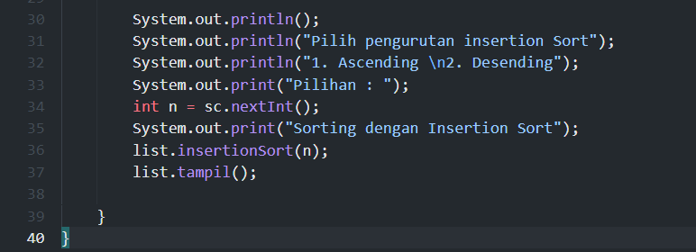
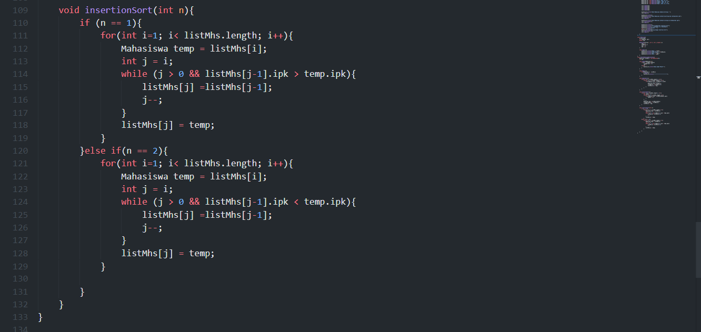
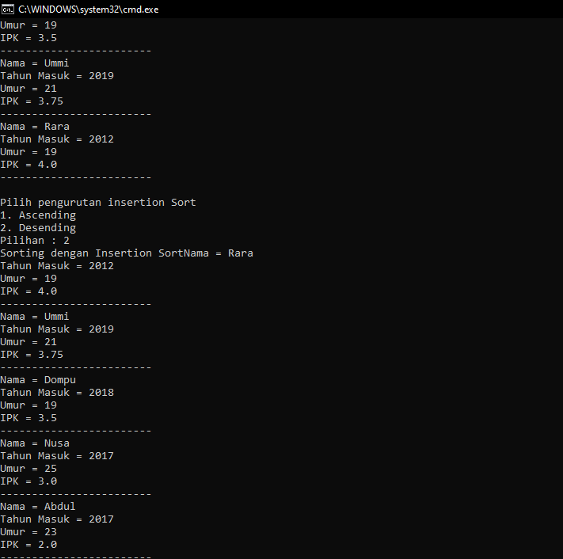

# Laporan Pertemuan 6

- Nama  : Arainal Aldiansyah
- Nim   : 2141720042
- Kelas : TI-1G

## Jawaban Pertanyaan
### Pertanyaan 5.2.3
1. Terdapat di method apakah proses bubble sort?
   - void bubbleSort()
2. Terdapat di method apakah proses selection sort?
   - void selectionSort()
3. Apakah yang dimaksud proses swap? Tuliskan potongan program untuk melakukan proses swap tersebut!
   - Proses swap adalah proses penukaran nilai sesuai dengan kondisi yang berlaku.
``` java
   Mahasiswa tmp = listMhs[idxMin];
   listMhs[idxMin] = listMhs[i];
   listMhs[i] = tmp;

```
4. Di dalam method bubbleSort(), terdapat baris program seperti di bawah ini: Untuk apakah proses tersebut?
   - dalam program tersebut dilakukan pengecekan jika nilai diarray ipk index ke j lebih besar dari index sebelumnya atau j-1 maka akan dilakukan penukaran
5. Perhatikan perulangan di dalam bubbleSort() di bawah ini:
    a. Apakah perbedaan antara kegunaan perulangan i dan perulangan j?
    - perulangan pada i digunakan untuk mengulang perulangan j
    - perulangan pada j digunakan untuk mengubah atau menukar nilainya
    b. Mengapa syarat dari perulangan i adalah i<listMhs.length-1 ? 
    - Karena sudah ada 1 nilai yang digunakan untuk kunci dari perbandingan
    c. Mengapa syarat dari perulangan j adalah j<listMhs.length-i ?
    - Karena perulangan j berada dalam perulangan i, dan j dimulai dari index 1 sehingga perulangan perlu di kurangi dengan i agar tidak melebihi index
    d. Jika banyak data di dalam listMhs adalah 50, maka berapakali perulangan i akan berlangsung? Dan ada berapa Tahap bubble sort yang ditempuh?
    - Perulangan i berlangsung 49 kali, dan akan menghasilkan 1225 tahapan bublesort dari penjumlahan deret setiap perulangannya 49 + 48 + . . . + 1

### Pertanyaan 5.3.3
### 5.4.3 Pertanyaan
Ubahlah fungsi pada InsertionSort sehingga fungsi ini dapat melaksanakan proses sorting dengan cara ascending atau decending, anda dapat melakukannya dengan menambahkan parameter pada pemanggilan fungsi insertionSort.


Output Program
