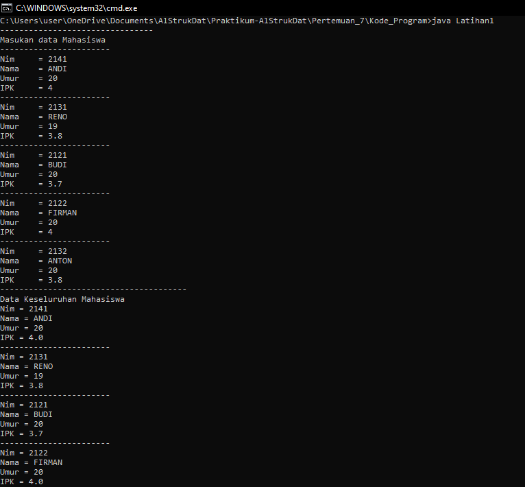
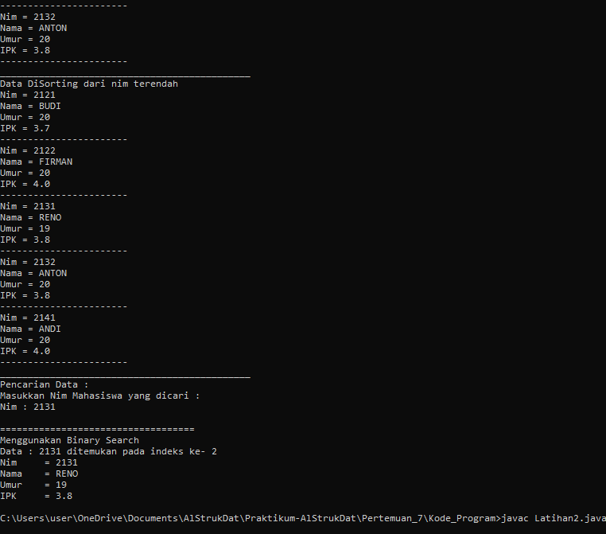
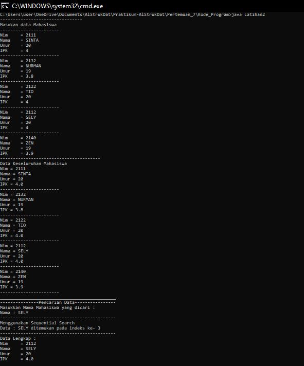
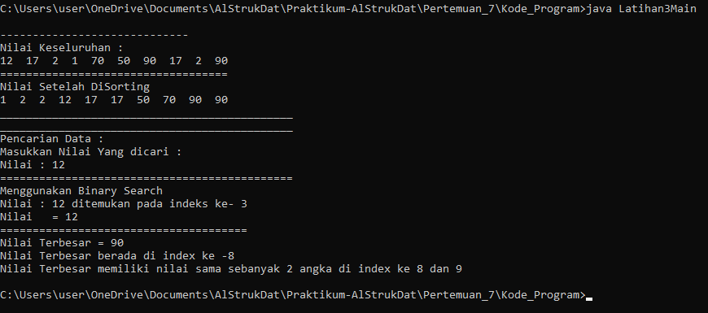

# Laporan Pertemuan 7

- Nama  : Arainal Aldiansyah
- Nim   : 2141720042
- Kelas : TI-1G

## Jawaban Pertanyaan
### 6.2.3. Pertanyaan
1. Jelaskan perbedaan metod TampilData dan Tampil posisi pada class PencarianMhs
   - Method TampilData digunakan untuk menampilkan data yang ditemukan
   - Method TampilPosisi diganakan untuk menampilkan posisi index data yang ditemukan
2. Jelaskan fungsi break pada kode program dibawah ini! 
   - digunakan untuk menghentikan perulangan jika data dalam array listMhs[j].nim sama dengan nilai yang dicari
3. Jika Data Nim yang dimasukkan tidak terurut dari kecil ke besar. Apakah program masih dapat berjalan? Apakah hasil yang dikeluarkan benar Mengapa demikian!
   - Program masih bisa berjalan, dan tidak masalah dan hasil yang dikeluarkan juga benar karena pada Sequencial dicari secara urut di semua indexnya sampai ditemukan yang sama dengan yang dicari.
### 6.3.3. Pertanyaan
1. Tunjukkan pada kode program yang mana proses divide dijalankan!
```java
   int mid;
        if(right >= left){
            mid = (left +right)/2;
```
2. Tunjukkan pada kode program yang mana proses conquer dijalankan!
```java
   if (cari == listmhs[mid].nim){
      return(mid);
   } else if (listmhs[mid].nim > cari){
      return FindBinarySearch(cari, left, mid-1);
   } else{
      return FindBinarySearch(cari, mid+1, right);
   }
```
3. Jika data Nim yang dimasukkan tidak urut. Apakah program masih dapat berjalan? Mengapa demikian!
- Data masih bisa berjalan, akan tetapi tidak bisa konsisten untuk menemukannya karena ada pembagian untuk ditengah dan wilayah kiri dan kanan
4. Jika Nim yang dimasukkan dari NIM terbesar ke terkecil (missal : 20215, 20214, 20212, 20211, 20210) dan elemen yang dicari adalah 20210. Bagaimana hasil dari binary search? Apakah sesuai? Jika tidak sesuai maka ubahlah kode program binary seach agar hasilnya sesuai
   - Hasil Tidak Sesuai
   - untuk modifikasi :
```java
   public int FindBinarySearch(int cari, int left, int right){
        int mid;
        if(right >= left){
            mid = (left +right)/2;
            if (cari == listmhs[mid].nim){
                return(mid);
            } else if (listmhs[mid].nim <> cari){           // Modifikasi
                return FindBinarySearch(cari, left, mid-1);
            } else{
                return FindBinarySearch(cari, mid+1, right);
            }
        }
        return -1;
    }
```
5. Modifikasilah program diatas yang mana jumlah mahasiswa yang di inputkan sesuai dengan masukan dari keyboard.
   - Dengan Menambah kan : 
```java
   System.out.print("Masukan Jumlah Mahasiswa : ");
   int jumMhs = s.nextInt();
```
### 6.5. Latihan Praktikum
1. Modifikasi percobaan searching diatas dengan ketentuan berikut ini
- Sebelum dilakukan searching dengan binary search data harus dilakukan pengurutan dengan menggunakan algoritma sorting (pilih salah satu algoritma sorting dari pertemuan sebelumnya)



2. Modifikasi percobaan searching diatas dengan ketentuan berikut ini
- Pencarian dilakukan berdasarkan Nama Mahasiswa (gunakan Algoritma Sequential Search)
- Jika terdapat nama yang sama? Bagaimana keluaran dari kode program ketika pencarian dilakukan pada nama yang sama!


3. Terdapat sebuah data array 1 dimensi sebagai berikut 
0 1 2 3 4 5 6 7 8
9
12 17 2 1 70 50 90 17 2
90
Buatlah program untuk mengurutkan array tersebut (boleh memilih metode pengurutan) 
selanjutnya lakukan pencarian dan mencetak isi array yang nilainya terbesar, dan mencetak ada 
berapa buah nilai terbesar tersebut serta berada dilokasi mana saja nilai terbesar tersebut! 
(menggunakan binary search)

